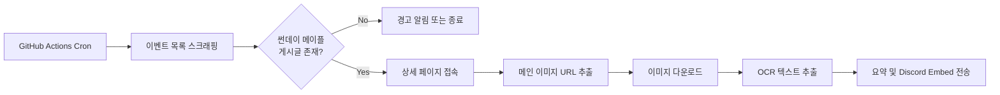

# 썬데이 메이플 알림 봇 (Sunday Maple Alarm)

메이플스토리 공식 이벤트 페이지에서 **썬데이 메이플** 공지를 자동 수집하고, 이미지 OCR로 혜택 텍스트를 추출한 뒤 **Discord Webhook**으로 알림을 보내는 **GitHub Actions** 기반 서버리스 자동화 봇입니다. 매주 **금요일 10:05 (KST)**에 1회 실행됩니다.

> **현재 단계:** 기획안 (코드 미작성)  
> 아래 내용을 검토·승인해 주시면 `main.py`, `requirements.txt`, GitHub Actions 워크플로우를 구현합니다.

---

## 1. 프로젝트 개요

| 항목 | 내용 |
|------|------|
| 목적 | 매주 금요일 10시 전후에 올라오는 썬데이 메이플 혜택을 Discord로 자동 알림 |
| 실행 환경 | GitHub Actions (`ubuntu-latest`) — **무료 티어** |
| 실행 주기 | 매주 금요일 **10:05 KST** (공지 10:00 + 5분 버퍼) |
| 비용 | GitHub Actions 무료 할당량 + Tesseract OCR 기준 **$0** |

### 처리 흐름



---

## 2. 대상 사이트 분석 (사전 조사 결과)

실제 HTML 구조를 확인한 결과, 아래와 같이 동작합니다.

### 2.1 이벤트 목록 페이지

- **URL:** `https://maplestory.nexon.com/News/Event`
- **구조:** `<ul class="event_all_banner">` 안의 `<li>` 카드 목록
- **카드 예시:**

```html
<li>
  <a href="/News/Event/1352">
    
  </a>
  <dl>
    <dt><a href="/News/Event/1352">스페셜 썬데이 메이플</a></dt>
    <dd><a href="/News/Event/1352">2026.06.28 (일) ~ ...</a></dd>
  </dl>
</li>
```

- **필터 조건:** 제목(`<dt>`)에 `썬데이 메이플` 또는 `스페셜 썬데이 메이플` 포함
- **이벤트 ID 추출:** `href`에서 숫자 추출 (예: `/News/Event/1352` → `1352`)
- **최신 게시글:** 목록 상단부터 순회하며 **첫 번째 매칭** 항목 사용

### 2.2 이벤트 상세 페이지

- **URL:** `https://maplestory.nexon.com/News/Event/Ongoing/{이벤트번호}`
- **혜택 이미지 위치:** `.qs_text .new_board_con` 내부

```html
<div class="qs_text">
  <div class="new_board_con">
    
  </div>
</div>
```

- **중요:** 목록 썸네일(`file.nexon.com/...FileDownloader`)과 **상세 본문 이미지(`lwi.nexon.com`)가 다릅니다.** OCR 대상은 **상세 페이지 본문 이미지**입니다.
- **부가 정보:** `.qs_title span` (제목), `.event_date` (기간)도 Embed에 활용

---

## 3. 프로젝트 폴더 구조 (예정)

```
sunday_maple_alarm/
├── README.md
├── requirements.txt
├── main.py
├── src/
│   ├── __init__.py
│   ├── scraper.py            # 목록/상세 페이지 스크래핑
│   ├── ocr.py                # 이미지 OCR 처리
│   ├── summarizer.py         # OCR 결과 정리·요약
│   └── discord_notifier.py   # Discord Webhook Embed 전송
├── .github/
│   └── workflows/
│       └── sunday_maple.yml
└── .gitignore
```

모듈을 나누되, 각 파일은 단일 책임만 갖도록 **최소한의 구조**로 유지합니다.

---

## 4. 기술 스택 및 Python 라이브러리

| 용도 | 라이브러리 | 비고 |
|------|-----------|------|
| HTTP 요청 | `requests` | User-Agent 헤더 포함 |
| HTML 파싱 | `beautifulsoup4` + `lxml` | CSS 선택자 기반 추출 |
| OCR (1차) | `pytesseract` + `tesseract-ocr-kor` | **무료, API 키 불필요** |
| OCR (2차, 선택) | OCR.space API | Tesseract 품질 부족 시 폴백 |
| 이미지 처리 | `Pillow` | OCR 전 리사이즈·전처리 |
| Discord 전송 | `requests` (Webhook POST) | Embed JSON 직접 구성 |

### requirements.txt (예정)

```
requests>=2.31.0
beautifulsoup4>=4.12.0
lxml>=5.0.0
Pillow>=10.0.0
pytesseract>=0.3.10
```

> `discord-webhook` 등 별도 SDK는 사용하지 않습니다. Webhook POST는 `requests` 한 번으로 충분합니다.

---

## 5. OCR 해결 방안 (핵심)

썬데이 메이플 혜택은 **디자인된 PNG 이미지**로 제공되므로 OCR 품질이 알림 품질을 좌우합니다.

### 5.1 권장: Tesseract OCR (Primary) — 100% 무료

| 항목 | 내용 |
|------|------|
| 장점 | API 키 불필요, GitHub Actions에서 apt로 설치 가능, 호출 제한 없음 |
| 단점 | 한글·게임 UI 폰트 인식률이 API 대비 다소 낮을 수 있음 |
| GitHub Actions 설치 | `sudo apt-get install -y tesseract-ocr tesseract-ocr-kor` |
| 언어 | `kor` (+ 필요 시 `kor+eng`) |
| 전처리 | 그레이스케일, 대비 향상, 필요 시 2배 업스케일 |

### 5.2 보조: OCR.space API (Fallback, 선택)

| 항목 | 내용 |
|------|------|
| 무료 한도 | IP당 **500회/일**, 파일 **1MB** 이하 |
| 용도 | Tesseract 결과가 빈 문자열이거나 글자 수가 극히 적을 때 1회 재시도 |
| API Key | [ocr.space/ocrapi](https://ocr.space/ocrapi) 무료 등록 |
| Secret | `OCR_SPACE_API_KEY` (선택 등록) |

### 5.3 OCR 결과 후처리 (`summarizer.py`)

1. 연속 공백·빈 줄 정리
2. Discord Embed `description` 필드 **4096자** 제한 준수 (초과 시 truncate)
3. 핵심 혜택을 bullet list 형태로 재구성 (가능한 경우)
4. OCR 실패 시에도 **이미지 원본 URL + 이벤트 페이지 링크**는 반드시 전송

---

## 6. Discord 알림 설계

### 6.1 성공 Embed (예시)

| 필드 | 내용 |
|------|------|
| `title` | `🍁 스페셜 썬데이 메이플 — {이벤트 기간}` |
| `description` | OCR 추출·요약된 혜택 텍스트 |
| `url` | `https://maplestory.nexon.com/News/Event/Ongoing/{id}` |
| `color` | `0xFF6B35` (메이플 오렌지 톤) |
| `image.url` | `lwi.nexon.com` 본문 이미지 URL |
| `footer.text` | `Sunday Maple Alarm Bot` |
| `timestamp` | ISO 8601 (실행 시각) |

### 6.2 오류·예외 Embed

| 상황 | Discord 동작 |
|------|----------------|
| 썬데이 메이플 게시글 없음 | ⚠️ 경고 Embed (「아직 공지 미등록」) |
| 네트워크/파싱 실패 | 오류 Embed + Actions 로그 |
| OCR 실패 | 이미지 URL·상세 링크만 포함한 Embed |
| Discord 전송 실패 | `sys.exit(1)` → Actions 실패 표시 |

---

## 7. GitHub Actions 설계

### 7.1 Cron 스케줄 (KST ↔ UTC)

| 항목 | 값 |
|------|-----|
| 목표 실행 시각 | **금요일 10:05 KST** |
| UTC 변환 | KST − 9h → **금요일 01:05 UTC** |
| Cron 표현식 | `5 1 * * 5` |

> GitHub Actions cron은 **UTC** 기준입니다.  
> `5 1 * * 5` = 매주 금요일 01:05 UTC = **10:05 KST**

### 7.2 워크플로우 개요 (`sunday_maple.yml`)

```yaml
name: Sunday Maple Alarm

on:
  schedule:
    - cron: '5 1 * * 5'   # 금 10:05 KST
  workflow_dispatch:       # 수동 실행 (테스트용)

jobs:
  notify:
    runs-on: ubuntu-latest
    steps:
      - uses: actions/checkout@v4
      - uses: actions/setup-python@v5
        with:
          python-version: '3.11'
      - name: Install Tesseract (Korean)
        run: sudo apt-get update && sudo apt-get install -y tesseract-ocr tesseract-ocr-kor
      - name: Install dependencies
        run: pip install -r requirements.txt
      - name: Run bot
        env:
          DISCORD_WEBHOOK_URL: ${{ secrets.DISCORD_WEBHOOK_URL }}
          OCR_SPACE_API_KEY: ${{ secrets.OCR_SPACE_API_KEY }}
        run: python main.py
```

### 7.3 무료 한도

- Public/Private repo Free 플랜: Actions **2,000분/월** — 주 1회·수 분 이내 실행이면 충분

---

## 8. GitHub Secrets

Repository → **Settings → Secrets and variables → Actions** 에 등록:

| Secret 이름 | 필수 | 설명 |
|-------------|------|------|
| `DISCORD_WEBHOOK_URL` | ✅ | Discord 채널 Webhook URL |
| `OCR_SPACE_API_KEY` | ⬜ | OCR.space 폴백 사용 시 (미등록 시 Tesseract만 사용) |

### Discord Webhook 생성 방법

1. Discord 서버 → 채널 설정 → **연동 → Webhook**
2. 「Webhook 만들기」→ URL 복사
3. GitHub Secret `DISCORD_WEBHOOK_URL`에 저장

---

## 9. 모듈별 책임 (구현 예정)

### `scraper.py`

- `fetch_event_list()` → HTML GET
- `find_latest_sunday_maple(soup)` → 키워드 매칭, event_id·title·period 반환
- `fetch_event_detail(event_id)` → 상세 페이지 GET
- `extract_main_image_url(soup)` → `.new_board_con img[src*="lwi.nexon.com"]`
- `download_image(url)` → `bytes` 반환

**키워드:** `썬데이 메이플`, `스페셜 썬데이 메이플` (부분 일치)

### `ocr.py`

- `extract_text_tesseract(image_bytes)`
- `extract_text_ocr_space(image_bytes)` (API 키 있을 때)
- `extract_text(image_bytes)` → Tesseract → 실패 시 OCR.space

### `summarizer.py`

- `format_for_discord(raw_text, max_length=3500)`

### `discord_notifier.py`

- `send_success_embed(...)`
- `send_error_embed(message)`

### `main.py` 실행 순서

```
1. 목록 스크래핑
2. 썬데이 메이플 게시글 탐색 (없으면 경고 후 종료)
3. 상세 페이지 + 이미지 URL 추출
4. 이미지 다운로드
5. OCR + 요약
6. Discord Embed 전송
```

---

## 10. 오류 처리 및 견고성

| 시나리오 | 처리 |
|----------|------|
| HTTP 4xx/5xx | `requests` + **최대 3회** exponential backoff 재시도 |
| 목록에 키워드 없음 | Discord 경고 Embed, exit code `0` (일시적 지연 가능) |
| 상세 이미지 selector 변경 | 로그 기록 후 오류 Embed |
| OCR 빈 결과 | 이미지·링크만 포함한 Embed |
| Discord 429 | 2초 대기 후 1회 재시도 |
| 타임아웃 | HTTP **30초** |

### 공지 지연 대비 (선택)

10:05 1회 실행으로 대부분 충분합니다. 지연이 잦다면 워크플로우에 **10:05 / 10:15 / 10:25** 3회 cron 추가도 가능합니다.

---

## 11. 보안·운영

- Webhook URL·API Key는 **코드·로그에 출력하지 않음**
- `.gitignore`: `__pycache__/`, `.env`, `*.pyc`, `.venv/`
- User-Agent: 일반 브라우저 문자열 사용 (차단 완화)
- 넥슨 페이지 **robots.txt·이용약관** 준수, **주 1회·비영리 개인 알림** 수준 유지

---

## 12. 구현 후 테스트 방법

1. GitHub에 repo push
2. Secret `DISCORD_WEBHOOK_URL` 등록
3. Actions → **Run workflow** (`workflow_dispatch`)
4. Discord Embed 수신 확인
5. 금요일 10:05 KST cron 자동 실행 확인

---

## 13. 승인 후 진행 작업

아래 항목을 **승인해 주시면** 바로 구현합니다.

- [ ] `requirements.txt`
- [ ] `src/scraper.py`, `src/ocr.py`, `src/summarizer.py`, `src/discord_notifier.py`
- [ ] `main.py`
- [ ] `.github/workflows/sunday_maple.yml`
- [ ] `.gitignore`

### 확인 부탁드리는 사항

1. **OCR 방식:** Tesseract 단독 vs Tesseract + OCR.space 폴백 — **폴백 포함을 권장**합니다.
2. **공지 미등록 시:** Discord 경고 알림을 보낼지, 조용히 종료할지
3. **Discord 채널:** Webhook만 사용 (봇 토큰·슬래시 커맨드 불필요) — 이대로 진행해도 될지

---

**승인 또는 수정 의견을 주시면, 위 구조대로 코드 작성을 시작하겠습니다.**
