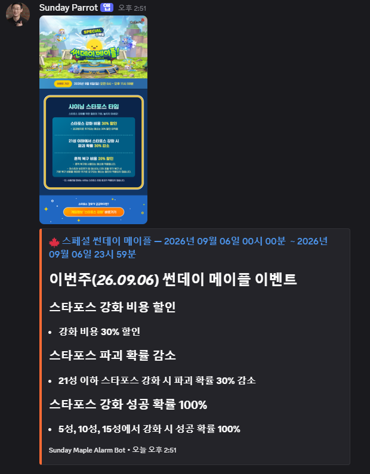

# 썬데이 메이플 알림 봇

메이플스토리 공식 이벤트 페이지에서 **썬데이 메이플** 공지를 찾아, 본문 이미지를 GPT Vision으로 요약한 뒤 Discord로 보내는 GitHub Actions 봇입니다. 친구들과 쓰는 채널에서 매주 금요일에 자동으로 돌아갑니다.

---

## 배경

썬데이 메이플 혜택은 HTML 본문이 아니라 **디자인된 공지 이미지**로만 올라옵니다. 이미지 안에는 글자뿐 아니라 파티클·장식 요소가 많아서, 매주 사람이 페이지를 열고 내용을 옮겨 적는 일이 반복됩니다.

이 저장소는 그 확인 작업을 자동화합니다.

---

## 접근

1. 넥슨 이벤트 목록에서 제목에 `썬데이 메이플`이 들어간 게시글을 찾습니다.
2. 상세 페이지의 본문 이미지(`lwi.nexon.com` `_board/` 경로)를 받습니다.
3. GPT Vision이 혜택을 Discord용 헤더/불릿 형식으로 정리합니다.
4. Embed와 원본 이미지를 Webhook으로 보냅니다.

처음에는 Tesseract OCR을 썼습니다. 장식과 글자를 구분하지 못해 Gemini Vision으로 바꿨고, Gemini는 이미지는 읽지만 출력 양식을 잘 지키지 못해 GPT와 예시 프롬프트로 다시 바꿨습니다.

---

## 동작 흐름

```text
금요일 10:06 / 10:16 / 10:26 KST
        │
        ▼
schedule_trigger.yml
        │  workflow_dispatch
        ▼
sunday_maple.yml  (Python 3.11)
        │
        ├─ 이번 주 같은 event_id면 종료
        ├─ 이벤트 목록 수집
        ├─ 본문 이미지 다운로드
        ├─ GPT Vision 요약
        └─ Discord Embed + 원본 이미지
```

스케줄은 `schedule_trigger.yml`에 있고, 실제 봇은 `sunday_maple.yml`이 실행합니다. GitHub Actions cron이 본 워크플로우에서 빠지던 문제에 대한 우회입니다. 공지가 아직 없으면 Discord에 아무것도 보내지 않고 끝냅니다. 같은 주·같은 이벤트는 `data/state.json`과 Actions cache로 한 번만 보냅니다.

---

## 구현 요지

| 모듈 | 역할 |
|------|------|
| `main.py` | 환경변수 검사, 중복 방지, 파이프라인 연결 |
| `src/scraper.py` | 목록/상세 페이지 파싱, 이미지 다운로드 |
| `src/gpt_analyzer.py` | 원본 이미지를 GPT Vision에 전달해 요약 |
| `src/summarizer.py` | 공백 정리, Discord 길이 제한 |
| `src/discord_notifier.py` | Webhook Embed + 파일 첨부 |
| `src/state.py` | KST ISO week + `event_id` 기준 멱등성 |

수집 대상:

- 목록: `https://maplestory.nexon.com/News/Event`
- 상세: `https://maplestory.nexon.com/News/Event/Ongoing/{event_id}`
- 본문 이미지: `lwi.nexon.com` 경로. 목록 썸네일과 다릅니다.

GPT 기본값은 `gpt-5.5`, 이미지 detail은 `low`입니다. `OPENAI_MODEL`, `OPENAI_IMAGE_DETAIL`로 덮을 수 있습니다.

---

## 기술 선택

**이미지 이해: OCR → Gemini → GPT**

혜택이 이미지로만 제공되고, 파티클 같은 장식이 많습니다. OCR은 글자와 장식을 구분하지 못했습니다. Gemini는 분석은 되었지만 Discord에 올릴 양식을 지키지 못해, 출력 예시를 넣은 GPT Vision으로 고정했습니다.

**실행 환경: GitHub Actions**

상시 서버 없이 금요일에만 돌립니다. 스케줄 미동작이 있어 cron을 별도 워크플로우로 분리했습니다.

**알림: Discord Webhook**

수신만 하면 되므로 Bot Token이나 슬래시 커맨드는 쓰지 않습니다.

**넥슨 페이지 접근**

GitHub Actions에서 페이지가 막힐 때를 대비해 Jina Reader(`r.jina.ai`)를 폴백으로 두었습니다. `JINA_API_KEY`는 선택입니다.

**이미지 전처리**

한동안 리사이즈·분할 후 분석했으나, 현재는 원본을 GPT와 Discord 양쪽에 그대로 보냅니다.

---

## 결과

친구들과 쓰는 Discord 채널에서 매주 자동 알림으로 사용 중입니다. 요약은 `low` detail로도 읽기 충분한 품질이었습니다.

실제 알림 예시:



원본 공지 이미지와, GPT가 정리한 Embed가 함께 도착합니다.

---

## 기여

이 저장소는 개인 프로젝트입니다. 기획과 디버깅은 작성자가 진행했고, 구현 코딩은 Cursor Agent가 작성했습니다.

---

## 한계

- 넥슨 페이지 HTML(또는 Jina 텍스트) 구조에 결합되어 있습니다. 마크업이 바뀌면 파서가 깨질 수 있습니다.
- 목록에서 키워드가 맞는 **첫 게시글만** 처리합니다.
- GPT 요약이 이미지와 다를 수 있습니다. 별도 검증은 없습니다.
- 중복 방지 상태 파일은 Actions cache에 의존합니다. cache가 사라지면 같은 주를 다시 보낼 수 있습니다.
- 스크래핑·GPT·Discord 실패 시 Discord로 오류 알림을 보내지 않고 Actions를 실패시킵니다.
- 테스트 코드는 없습니다.

---

## 기술 스택

| 기술 | 역할 |
|------|------|
| Python 3.11 | 런타임 |
| requests, BeautifulSoup, lxml | 페이지 수집·파싱 |
| OpenAI Chat Completions (Vision) | 이미지 요약 |
| Discord Incoming Webhook | 알림 전송 |
| GitHub Actions | 스케줄과 실행 |
| Jina Reader | 넥슨 페이지 차단 대비 폴백 |

---

## 실행 방법

저장소 Secrets:

| 이름 | 필수 | 설명 |
|------|------|------|
| `DISCORD_WEBHOOK_URL` | 예 | Discord 채널 Webhook |
| `OPENAI_API_KEY` | 예 | GPT Vision |
| `JINA_API_KEY` | 아니오 | Jina 폴백용 |

GitHub Actions에서 `Sunday Maple Alarm` 워크플로우를 수동 실행할 수 있습니다. `force_run`을 켜면 이번 주 중복 방지를 건너뜁니다.

로컬에서는 `.env`를 자동으로 읽지 않습니다. 환경변수를 설정한 뒤 실행합니다.

```bash
pip install -r requirements.txt
export DISCORD_WEBHOOK_URL="..."
export OPENAI_API_KEY="..."
python main.py
```

Windows PowerShell:

```powershell
pip install -r requirements.txt
$env:DISCORD_WEBHOOK_URL = "..."
$env:OPENAI_API_KEY = "..."
python main.py
```

테스트로 다시 보내려면 `FORCE_NOTIFY=true`를 넣습니다.
